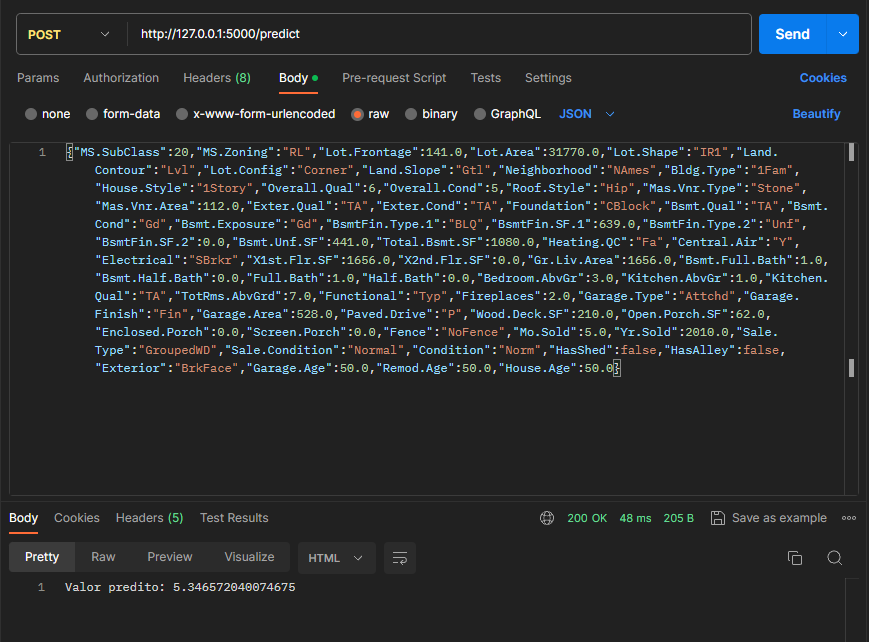

# AmesML

## API

#### Para utilizar a api basta utilizar o comando abaixo (estando na raíz do projeto), ou executar o arquivo "api.py":

```
python api/api.py

```

### Entrada

Como entrada esperamos um json com todas as features utilizadas pelo nosso modelo. Um exemplo está a seguir:

{"MS.SubClass":20,"MS.Zoning":"RL","Lot.Frontage":141.0,"Lot.Area":31770.0,"Lot.Shape":"IR1","Land.Contour":"Lvl","Lot.Config":"Corner","Land.Slope":"Gtl","Neighborhood":"NAmes","Bldg.Type":"1Fam","House.Style":"1Story","Overall.Qual":6,"Overall.Cond":5,"Roof.Style":"Hip","Mas.Vnr.Type":"Stone","Mas.Vnr.Area":112.0,"Exter.Qual":"TA","Exter.Cond":"TA","Foundation":"CBlock","Bsmt.Qual":"TA","Bsmt.Cond":"Gd","Bsmt.Exposure":"Gd","BsmtFin.Type.1":"BLQ","BsmtFin.SF.1":639.0,"BsmtFin.Type.2":"Unf","BsmtFin.SF.2":0.0,"Bsmt.Unf.SF":441.0,"Total.Bsmt.SF":1080.0,"Heating.QC":"Fa","Central.Air":"Y","Electrical":"SBrkr","X1st.Flr.SF":1656.0,"X2nd.Flr.SF":0.0,"Gr.Liv.Area":1656.0,"Bsmt.Full.Bath":1.0,"Bsmt.Half.Bath":0.0,"Full.Bath":1.0,"Half.Bath":0.0,"Bedroom.AbvGr":3.0,"Kitchen.AbvGr":1.0,"Kitchen.Qual":"TA","TotRms.AbvGrd":7.0,"Functional":"Typ","Fireplaces":2.0,"Garage.Type":"Attchd","Garage.Finish":"Fin","Garage.Area":528.0,"Paved.Drive":"P","Wood.Deck.SF":210.0,"Open.Porch.SF":62.0,"Enclosed.Porch":0.0,"Screen.Porch":0.0,"Fence":"NoFence","Mo.Sold":5.0,"Yr.Sold":2010.0,"Sale.Type":"GroupedWD","Sale.Condition":"Normal","Condition":"Norm","HasShed":false,"HasAlley":false,"Exterior":"BrkFace","Garage.Age":50.0,"Remod.Age":50.0,"House.Age":50.0}

### Saída

Utilizando a rota http://127.0.0.1:5000/predict, com um método de requisição POST e enviando o json acima temos a resposta desejada. Podemos realizar esse procedimento com uma ferramenta de testes de api, como o Postman. 


